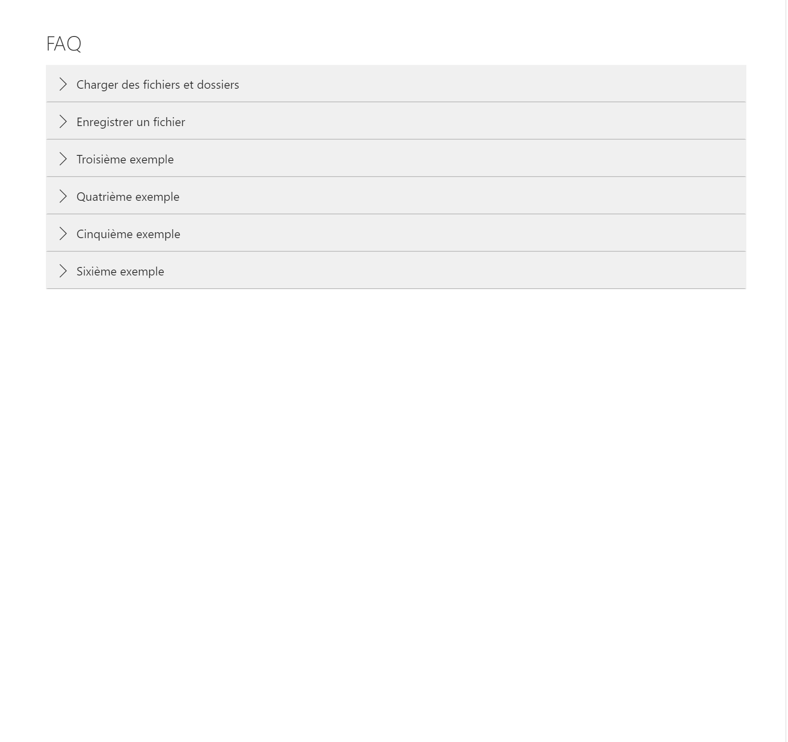

# Accordion Control Sample

## Summary

Sample web part which demonstrates how to creates an accordion that looks good in SharePoint. Written in response to StackExchange question [How make accordion detail list with UI fabric react](https://sharepoint.stackexchange.com/questions/268362/how-make-accordion-detail-list-with-ui-fabric-react).

Accordion look and feel inspired by [this Microsoft site](https://www.microsoft.com/en-us/home-use-program/frequently-asked-questions).

Not intended to be a full sample. Please log an issue if you need this sample to be more fully functioning.

## Used SharePoint Framework Version

## Applies to

* [SharePoint Framework](https:/dev.office.com/sharepoint)
* [Office 365 tenant](https://dev.office.com/sharepoint/docs/spfx/set-up-your-development-environment)

## Prerequisites

This code sample isn't a full functioning web part. It assumes that you will retrieve data from a list.

## Solution

Solution|Author(s)
--------|---------
AccordionWebPart | Hugo Bernier (@bernierh)

## Version history

Version|Date|Comments
-------|----|--------
1.0|August 25, 2019|Initial release

## Disclaimer

**THIS CODE IS PROVIDED *AS IS* WITHOUT WARRANTY OF ANY KIND, EITHER EXPRESS OR IMPLIED, INCLUDING ANY IMPLIED WARRANTIES OF FITNESS FOR A PARTICULAR PURPOSE, MERCHANTABILITY, OR NON-INFRINGEMENT.**

---

## Minimal Path to Awesome

* Clone this repository
* in the command line run:
  * `npm install`
  * `gulp serve`

This code sample returns hard-coded questions and answers. You'll probably want to add your own code to load and filter the Q&As. File an issue if you need help, and I'll update this sample accordingly.

## Features

Creates an expandable and collapsable accordiong control which looks like the one found on Microsoft sites.
